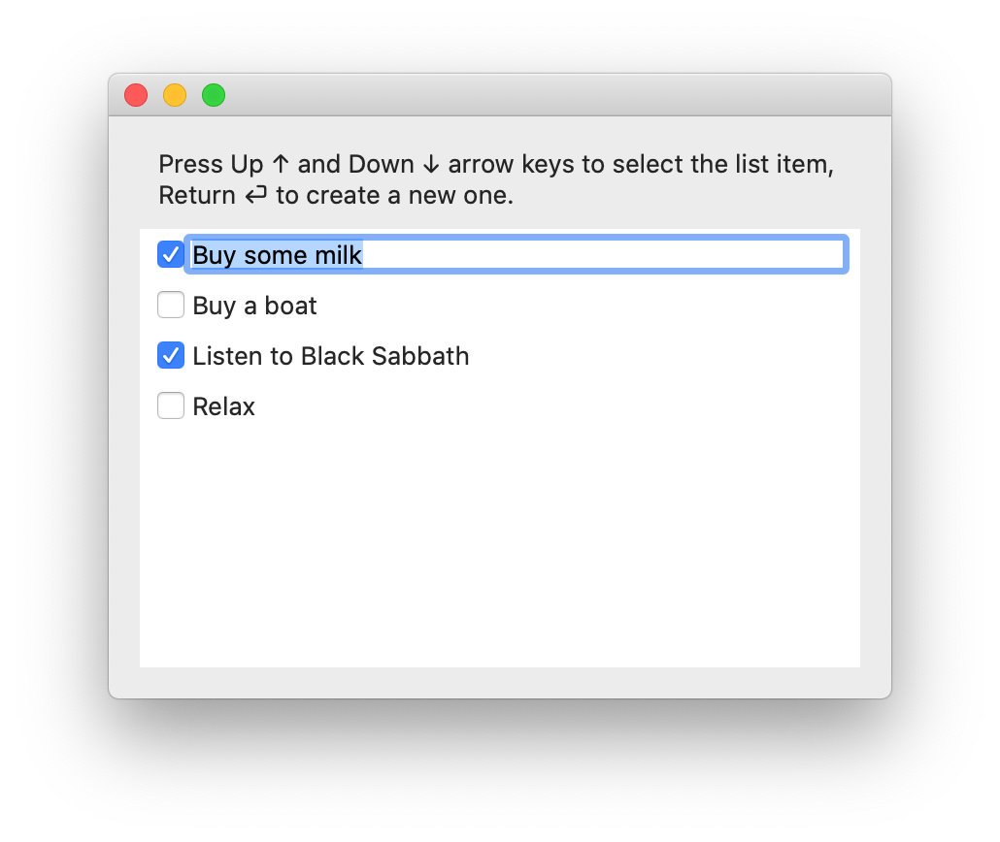

Trying to build a basic list editor for macOS with SwiftUI.

To-do:
- [ ] Fix clicking on the input
- [ ] Implement Return key in the beginning of the line or in the middle
- [ ] Move just the cursor, not the whole focus

